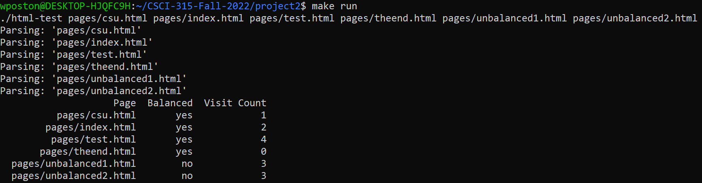
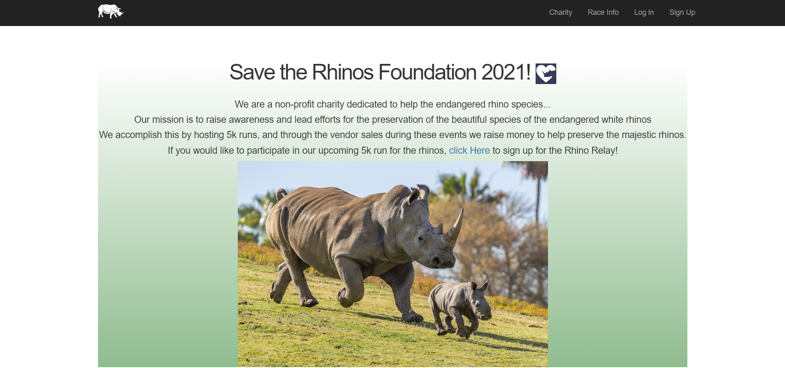

Portfolio
=========

Programming Projects
--------------------

*For access to my private project repositories, please [email me](mailto:example@csustudent.net?subject=GitHub%20Access) with the subject line, GitHub Access.

---
### [OOP Project | CSCI 325](/project1.md)

---
### [HTML Parser and Crawler | CSCI 315](/project2.md)

---
### [Ruby on Rails Website | CSCI 334](/project3.md)

---
### [Comp Arch lab or Verilog | CSCI 330](/project4.md)

---

Ethics Papers
-------------

### [White Paper 1 - Edward Snowden and the Wiki Leaks Scandal](/pdf/White_Paper_1_Edward_Snowden.pdf)

-   **Class:** CRIM 405 - Principles of Cyber Security
-   **Grade:** A

### [Ethics Paper: Therac-25](/pdf/Ethics_Paper.pdf)

-   **Class:** CSCI 315 - Data Structures Analysis
-   **Grade:** D

### [Network Penetration Ehtics Paper](/pdf/Network_Pen_Ethics_Paper.pdf)

-   **Class:** CSCI 452 - Network Penetration and Ethical Hacking
-   **Grade:** B+

---

Presentations
-------------

### [Colonial Pipeline Breach](/pdf/Colonial Pipeline breach.pdf)

- **Class:** CRIM 405 - Principles of Cyber Security
- **Grade:** A

### [Buffer Overflow](/pdf/Buffer_Overflow.pdf)

- **Class:** CSCI 330 - Computer Architecture
- **Grade:** B

---

Page template forked from <a href="https://github.com/csu-cs/csci-portfolio">CSU-CS</a>

<!-- Remove above link if you don't want to attributive -->
