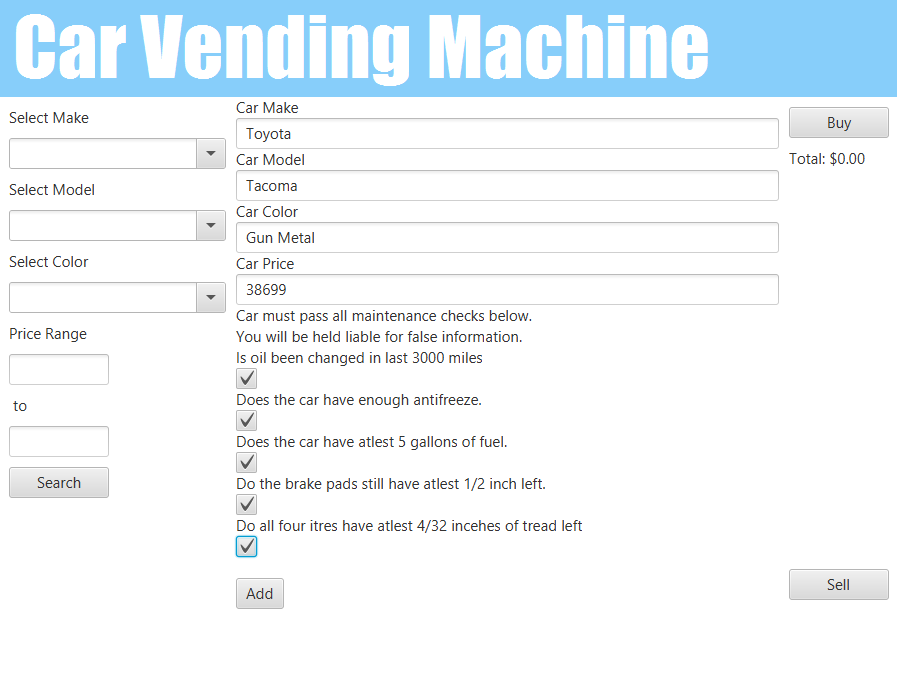

[Back to Portfolio](./)

Car Vending Machine
===============

-   **Class:** CSCI 325
-   **Grade:** C+
-   **Language(s):** JAVA
-   **Source Code Repository:** [WalkerPoston/OOP-Project](https://github.com/WalkerPoston/OOP-Project)  
    (Please [email me](mailto:walkerposton@gmail.com?subject=GitHub%20Access) to request access.)

## Project description

This project is supposed to resemble a vending machine for vehicles. The user will have the option to search the existing inventory, purchase a vehicle, or sell their vehicle. To search the inventory, the user will enter details like, make, model, and color, and all of the available vehicles with those specifications will be displayed. To purchase a vehicle, once the user finds the vehicle they wish to purchase, all they need to do is click the buy button and the vehicle will be removed from the inventory. For the user to sell their vehicle, they first need to click the sell button. After the sell button is clicked, a screen will be displayed asking them to enter their vehicle's make, model, and color. they will also need to check all of the boxes regarding the maintenance of their vehicle. if they try to sell their vehicle with any of the maintenance boxes unchecked, the program will ask them to fix the issue and check the box. Once all the boxes are checked and the sell button is clicked, the user's vehicle will be added to the inventory.

## How to run the program

Open up Apache NetBeans IDE 17 with the Java Development Kit 8. Open the project and click the green play button which runs the project.

## UI Design

This project was the final project for CSCI 325. It should act like a vending machine but for vehicles. Once the user loads into the main screen, they have the option to search for a car, buy a car, or sell their car (Figure 1). On the left side of the screen, there are parameters that can be used to help specify the search, like the vehicle's make, model, and color. These parameters are optional, and not required for the search. What happens when there are no parameters entered, the program will list all of the vehicles that are in the inventory (Figure 2). 

To buy a vehicle from the inventory, all that needs to be done is to select the vehicle to be purchased, which will give you a balance, and click "Buy" (Figure 3). This will remove the vehicle from the inventory (Figure 4). 

To add a vehicle to the inventory, first, the sell button must be clicked. Then, the  parameters must be entered and all of the maintenance boxes checked (Figure 5). If any of the maintenance boxes are not checked, then the program will ask the user to address the issue and then check that box (Figure 6). Once all the sale parameters are entered, the maintenance boxes checked and the "Sell" button is clicked, that vehicle will be added to the inventory (Figure 7).

  
Fig 1. The Main screen

  
Fig 2. Output when there are no parameters specified.

  
Fig 3. Buying a vehicle.

  
Fig 4. The vehicle has been removed from the inventory.

  
Fig 5. Sell screen when all parameters are entered and maintenance boxes are checked.

  
Fig 6. Sell screen with unchecked maintenance boxes.

  
Fig 7. A new vehicle is shown in the inventory. 

For more details see [GitHub Flavored Markdown](https://guides.github.com/features/mastering-markdown/).

[Back to Portfolio](./)
