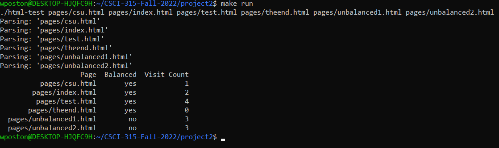

[Back to Portfolio](./)

HTML Parser and Crawler
===============

-   **Class:** CSCI 315
-   **Grade:** D
-   **Language(s):** C++
-   **Source Code Repository:** [WalkerPoston/CSCI-315-Project-2](https://github.com/WalkerPoston/CSCI-315-Project-2)  
    (Please [email me](mailto:walkerposton@gmail.com?subject=GitHub%20Access) to request access.)

## Project description

This project reads HTML files line by line and parses out the input in order to determine if the file is balanced, meaning every opening tag has a closing tag and that those tags are in the correct HTML file structure. Once the files have been parsed, the program will then determine the number of unique pages that can be visited from a certain page.

## How to compile and run the project

How to compile and run the project.

```
make run
```

How to run individual files.

```
./html-test pages/file-name.html
```


## UI Design

Almost every program requires user interaction, even command-line programs. Include in this section the tasks the user can complete and what the program does. You don't need to include how it works here; that information may go in the project description or in an additional section, depending on its significance.

Once the program is executed, the results will be output to the screen (see Fig 1). You will see in the output that the program parsed all of the files that were included in the code. Then, below that, there will be a table with three columns that have the page, whetheer the page is balanced, and the number of pages that can be visited from that page. 

  
Fig 1. Program output


## 3. Additional Considerations

Sed ut perspiciatis unde omnis iste natus error sit voluptatem accusantium doloremque laudantium, totam rem aperiam, eaque ipsa quae ab illo inventore veritatis et quasi architecto beatae vitae dicta sunt explicabo. 

For more details see [GitHub Flavored Markdown](https://guides.github.com/features/mastering-markdown/).

[Back to Portfolio](./)
