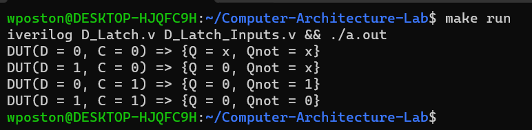

[Back to Portfolio](./)

Computer Architecture Verilog Lab
===============

-   **Class:** CSCI 330
-   **Grade:** B
-   **Language(s):** Assembly/Verilog
-   **Source Code Repository:** [WalkerPoston/Computer-Architecture-Lab](https://github.com/WalkerPoston/Computer-Architecture-Lab)  
    (Please [email me](mailto:walkerposton@gmail.com?subject=GitHub%20Access) to request access.)

## Project description

This project is one of the Verilog labs from CSCI 330. The lab represents a simple implementation of a D latch and a testbench to simulate its behavior. The "dlatch" is a Verilog module that represents a D latch, a sequential logic element, it has two input ports: D (data input) and C (clock input), and two output ports: Q (output) and Qnot (inverted output). Inside the module, three wire connections (A1, A2, and B1) are declared, representing intermediate signals in the logic. Two not gates are used to generate the complement of the clock signal C. The first gate, gate1 generates A1, which is the inverse of C, and gate2 generates A2, which is the inverse of D and C. A third "and" gate (gate3) generates B1 based on the inputs D, A1, and C. Finally, two "nor" gates (gate4 and gate5) are used to produce the outputs Q and Qnot based on the signals A2, Q, B1, and Qnot.

The "simple-test" Module is a testbench module used to verify the behavior of the dlatch module. It declares a set of registers (reg) for D and C, and wires for Q and Qnot. It instantiates an instance of the dlatch module named DUT (Device Under Test) with connections to D, C, Q, and Qnot. In the initial block, a sequence of tests is performed to observe the behavior of the D latch under different input conditions. First, D and C are set to 0, and the simulation is advanced by 7 time units. The $display system task is used to print the values of D, C, Q, and Qnot. Then, D and C are set to various combinations of 0 and 1, and their effects on Q and Qnot are displayed after each change. The outputs can be either 0, 1, x (unknown or conflict) or z (tristate or unconnected).

The code effectively models the operation of a D latch and tests its response to different input conditions. It demonstrates the use of Verilog constructs such as gates (and, not, nor), modules, wires, and system tasks ($display) to simulate and test digital logic behavior. The DUT instance represents the D latch under test, and the testbench monitors its behavior and displays the results.

## How to run the program

How to run the project.

```bash
cd Computer-Architecture-Lab
make run
```

## UI Design


Almost every program requires user interaction, even command-line programs. Include in this section the tasks the user can complete and what the program does. You don't need to include how it works here; that information may go in the project description or in an additional section, depending on its significance.

Lorem ipsum dolor sit amet (see Fig 1), consectetur adipiscing elit, sed do eiusmod tempor incididunt ut labore et dolore magna aliqua. Ut enim ad minim veniam, quis nostrud exercitation ullamco laboris nisi ut aliquip ex ea commodo consequat (see Fig 2). Duis aute irure dolor in reprehenderit in voluptate velit esse cillum dolore eu fugiat nulla pariatur. Excepteur sint occaecat cupidatat non proident, sunt in culpa qui officia deserunt mollit anim id est laborum (see Fig 3).

  
Fig 1. 

## 3. Additional Considerations

Sed ut perspiciatis unde omnis iste natus error sit voluptatem accusantium doloremque laudantium, totam rem aperiam, eaque ipsa quae ab illo inventore veritatis et quasi architecto beatae vitae dicta sunt explicabo. 

For more details see [GitHub Flavored Markdown](https://guides.github.com/features/mastering-markdown/).

[Back to Portfolio](./)

